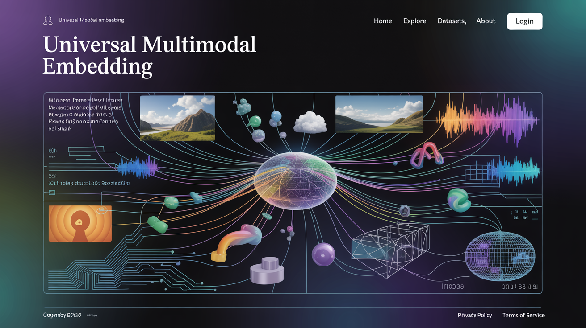
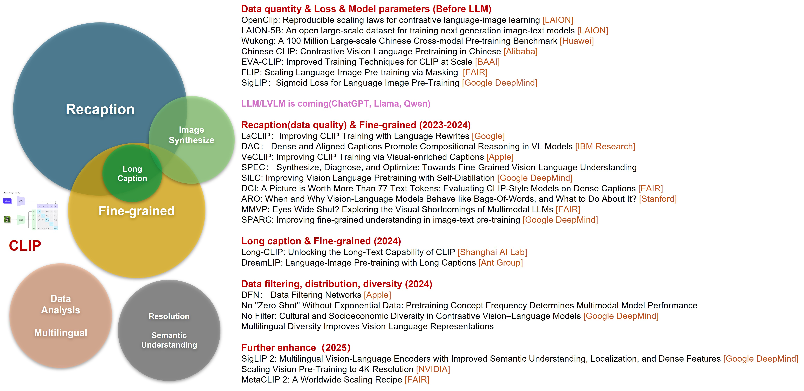
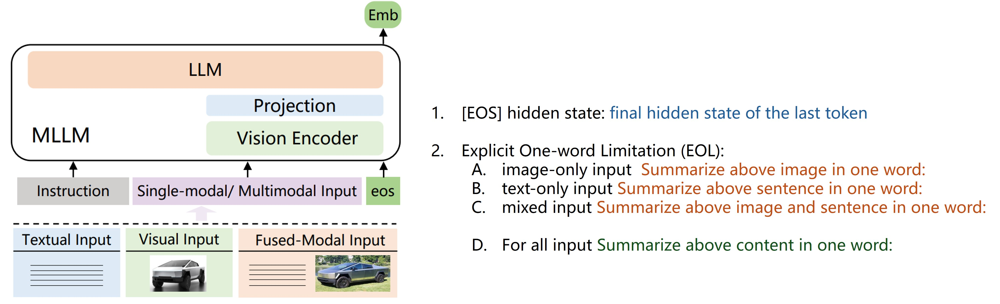
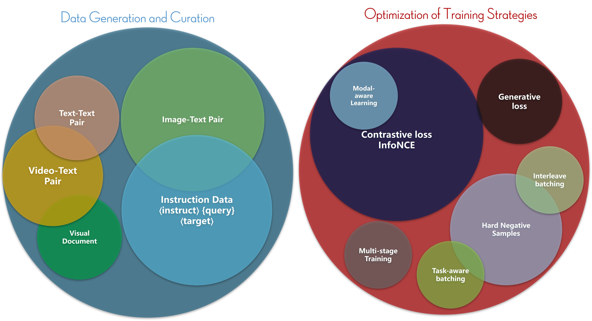
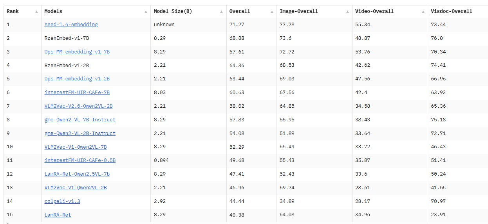

## Toward Universal Multimodal Embedding



- [The Dawn of an Era: CLIP Connects Text and Images](#the-dawn-of-an-era-clip-connects-text-and-images)
- [CLIP as an Embedding Extractor](#clip-as-an-embedding-extractor)
  - [Era 1: 2021–2023 (Before the LLM/MLLM Explosion)](#era-1-20212023-before-the-llmmllm-explosion)
  - [Era 2: 2023–2025 (After the LLM/MLLM Explosion)](#era-2-20232025-after-the-llmmllm-explosion)
- [Building MLLM Embedding Models](#building-mllm-embedding-models)
  - [The Paradigm Shift: MLLMs as Embedding Models](#the-paradigm-shift-mllms-as-embedding-models)
  - [Data Generation and Construction](#data-generation-and-construction)
  - [Training Strategy Optimization and Improvement](#training-strategy-optimization-and-improvement)
  - [Conclusion and Future Outlook](#conclusion-and-future-outlook)
- [Paper List](#paper-list)
- [Demo and Visualizations](#demo-and-visualizations)


**TL;DR**: This article provides a systematic review of the evolution of multimodal embedding technology, tracing its journey from the advent of CLIP to the current era of Universal Multimodal Embedding. We divide this progression into two key periods, analyzing how Large Language Models (LLMs) and Multimodal Large Language Models (MLLMs) have driven embeddings to become more universal and semantically intelligent. The article explores the paradigm shift from traditional dual-tower architectures to new MLLM-based frameworks, deconstructing the critical roles of data construction and training strategies through a case study of Seed1.6-Embedding. Finally, we offer a comprehensive paper list and a reproducible demo based on the GME model to serve as a valuable reference for both academic and industrial practitioners.  
If you understand Chinese, you can check out this [article](https://zhuanlan.zhihu.com/p/1933650595606148849) on Zhihu.


### The Dawn of an Era: CLIP Connects Text and Images

Our story begins in early 2021 with a blog post from OpenAI titled "CLIP: Connecting Text and Images."

This work, CLIP (Contrastive Language-Image Pre-Training), demonstrated a remarkably concise and effective method for building unified vision-language representations through large-scale contrastive learning. It is widely regarded as a milestone in the field of Vision-Language (VL) research. The core idea of CLIP is straightforward: supervised contrastive learning on a massive scale using image-text pairs. However, its real-world impact has far transcended the technique itself. Today, virtually any system that needs to bridge vision and language—be it zero-shot image classification, cross-modal retrieval, visual question answering (as seen in models like GPT-4o, Gemini 1.5 Pro, InternVL, and Qwen-VL), text-to-image/video generation (Stable Diffusion, Midjourney, Ideogram, VEO), or even end-to-end perception for autonomous driving—is directly or indirectly influenced by CLIP.

In this article, we will focus on a research direction that has been relatively niche but is gaining significant importance: **Universal Multimodal Embedding**.

We will systematically explore the technological evolution post-CLIP, particularly how Large Language Models and Multimodal Models (LLMs/MLLMs) are driving multimodal representations toward greater universality and semantic alignment. We will also analyze the profound impact of this trend on feature extraction and cross-modal retrieval tasks. The following analysis is based on my personal understanding of the field and may have its biases. It is my hope that this review will spark further discussion and inspire deeper exploration and practical application in both academia and industry.

---

### CLIP as an Embedding Extractor

Since its debut, one of CLIP's most critical and valuable applications has been as a feature extractor for cross-modal retrieval and other downstream vision-language tasks. Compared to unimodal or weakly multimodal specialist networks of its time, CLIP's open-set recognition and generalization capabilities were outstanding. The fundamental reason for this success was its use of contrastive learning to compress billions of image-text pairs from the web (Alt-text) into a single high-dimensional semantic space. Within this space, the representations of sentences, words, phrases, and even visual patches can be directly compared using cosine similarity to measure their relevance, making it a natural fit for the "retrieval-as-inference" paradigm.

Of course, this purely brute-force approach is not without its issues. In the four-plus years since its introduction, academia and industry have been continuously working to optimize it. From the perspective of multimodal and cross-modal retrieval, I categorize this evolution into **"Two Eras"** and **"Multiple Keywords"**:



#### Era 1: 2021–2023 (Before the LLM/MLLM Explosion)
During this period, work in the CLIP family included the open-source training framework OpenCLIP, large-scale datasets (LAION-5B, Wukong), multilingual CLIP variants (ChineseCLIP, AltCLIP, m-clip), various training strategies (FLIP, SigLIP), and model scaling (EVA-CLIP-18B). The focus was primarily on building infrastructure and exploring training methodologies.

#### Era 2: 2023–2025 (After the LLM/MLLM Explosion)
The research focus has pivoted from "making it bigger" to "making it smarter." The core challenges and corresponding research directions can be summarized along four main lines:

*   **Data and Training Strategy:**
    *   Image-text pairs often rely on noisy Alt-text, and using only a global contrastive loss makes it difficult to capture **fine-grained** semantics and **compositional reasoning**.
    *   The model's representation ability for long texts (>77 tokens) degrades significantly, limiting its understanding of complex descriptions.
    *   A need for stronger **semantic understanding** to support complex downstream tasks like VQA (Visual Question Answering) and REC (Referring Expression Comprehension).
*   **Vision Encoder Bottlenecks:**
    *   Vision Transformers (ViTs) with fixed patch sizes and low input resolutions (e.g., 224x224) cannot handle dynamic or high-resolution images (e.g., 4K), leading to substantial loss of detail.
*   **Data Diversity and Regional Bias:**
    *   Uneven distribution of multilingual, cross-cultural, and geographically diverse image data affects the model's generalization and fairness.
    *   Data filtering strategies such as denoising, deduplication, and resampling have a direct impact on the model's ability to learn long-tail concepts and improve robustness.

As illustrated by the continuous evolution of Vision-Language Models (VLMs), the research emphasis is shifting from relying on massive, high-quality open-source image-text datasets to actively constructing private datasets with greater diversity and semantic precision. This trend, propelled by MLLMs like LLaVA and GPT-4o, has given rise to a new research paradigm.

Leading institutions worldwide, including Google DeepMind, Meta AI, Apple, Alibaba, and BAAI, have focused on optimizing key aspects of the image-text matching task. Significant progress has been made in areas such as re-captioning (including long captions), image synthesis, fine-grained understanding, data analysis, multilingual support, resolution handling, and semantic depth.

Concurrently, evaluation systems have become more multidimensional and rigorous. For example, new benchmarks like MMVP and ARO have further exposed the potential shortcomings of CLIP and related models in compositional reasoning and fine-grained understanding. To address these challenges, researchers are gradually building a "model-in-the-loop" ecosystem for data generation, where models are not only used to analyze task performance but also actively participate in the data construction and optimization process.

A new generation of CLIP-like models, exemplified by **SigLIP**, embodies this trend. SigLIP v1 introduced a Sigmoid Loss, modeling image-text matching as an independent binary classification problem, which improved training efficiency and the model's ability to capture details. SigLIP v2 further integrated image-text generation, self-supervised mechanisms, and real-time data scheduling strategies to create a unified training pipeline. This significantly enhanced its performance across various tasks, including zero-shot classification, retrieval, image-text correspondence, and dense prediction. Furthermore, its **NaFlex** architecture supports multi-resolution inputs while preserving the original aspect ratio, making it suitable for scenarios requiring high-resolution support, such as OCR and document understanding.

---

### Building MLLM Embedding Models

#### The Paradigm Shift: MLLMs as Embedding Models

Despite CLIP's success in cross-modal retrieval, its limitations remain significant:

*   **Limited Functionality:** Traditional CLIP models primarily support bidirectional image-to-text and text-to-image retrieval. They perform poorly on more complex compositional queries (e.g., Image + Text → Image, or I+T → T) and do not support interleaved inputs (Interleaved I+T → I).
*   **Lack of Complex Semantic Understanding:** Compared to LLMs, CLIP lacks rich world knowledge and instruction-following capabilities, making it unsuitable for tasks that require deep reasoning or complex contextual understanding.
*   **The Modality Gap:** CLIP utilizes a dual-tower architecture where the vision and text encoders are often pre-trained independently. Even after fine-tuning on large-scale image-text pairs, a noticeable modality gap persists.
*   **Poor Resolution Adaptability:** Even advanced models like SigLIP with its NaFlex architecture can suffer from feature compression and information loss when faced with high-resolution inputs like 2K or 4K images.

These bottlenecks have prompted the research community to turn its attention to the more versatile **Multimodal Large Language Models (MLLMs)**:

*   **Native Support for Complex Inputs and Reasoning:** MLLMs can naturally process interleaved image-text inputs and follow complex instructions, demonstrating superior generalization in tasks like language understanding and compositional reasoning.
*   **A More Unified Feature Space:** By unifying cross-modal comparisons within the text space, MLLMs can reduce or even eliminate the modality gap.
*   **Support for Dynamic Resolution:** Advanced models such as Qwen2.5-VL and InternVL-3 have implemented Dynamic Resolution technology, allowing them to flexibly adapt to various input resolutions and effectively mitigate information loss.

This raises a natural question: why not move beyond the traditional CLIP dual-tower architecture?
**"Directly adapt an MLLM to serve as a universal multimodal embedding model."** This is an intuitive and compelling direction. Although MLLMs exhibit powerful generalization and expressive capabilities, two core problems must be solved before they can be effectively used for multimodal retrieval:

- **Problem 1: Since LLMs/MLLMs are trained for Next-Token Prediction, where does the embedding come from?**
- **Problem 2: Is additional training required? If so, how should it be done?**

For the first problem, we can draw an analogy to how CLIP extracts global semantic features. We can directly use the hidden state of the `[EOS]` (End of Sentence) token from the final layer of the LLM after a forward pass. This vector can be seen as the model's compressed semantic representation after "understanding" the entire input. Furthermore, we can enhance this semantic alignment through prompting. This involves providing an instruction that guides the model to output the target embedding. For instance (inspired by E5-V):



*   `Summarize the above image in one word:` to extract an embedding for a pure image input.
*   `Summarize the above sentence in one word:` to extract an embedding for a pure text input.
*   `Summarize the above image and sentence in one word:` to extract an embedding for a mixed input.

A more universal prompt, `Summarize the above content in one word:`, could unify the embedding extraction process for all input types, avoiding the need for logic to handle different modalities.

For the second problem, intuition suggests that additional training is necessary. Although all inputs (pure image, pure text, or image+text) are tokenized and processed by the LLM to produce an embedding, the model's original training objective of next-token prediction results in a semantic space that is different from one trained via contrastive learning. Therefore, while using the hidden state of a pre-trained MLLM directly as an embedding might show some promise in zero-shot settings (e.g., demonstrating reasonable similarity scores), achieving high-performance multimodal retrieval—especially for complex compositional queries (e.g., I+T → I+T)—likely requires additional fine-tuning or specialized data to align the semantic space.

So, how should this training be conducted? A viable approach is to adapt CLIP's contrastive learning paradigm to the MLLM architecture. This would involve applying an **InfoNCE loss** function to the MLLM's output embeddings, encouraging matching modal pairs (image-text, image-image, mixed-input pairs, etc.) to move closer in the embedding space while pushing non-matching pairs apart.

To further enhance the MLLM's robustness and instruction-following ability for embedding extraction, a **multi-task training** strategy can be introduced. This strategy aims to comprehensively improve the MLLM's performance and generalization:
1.  **Contrastive Learning:** Use a loss like InfoNCE to optimize the similarity metric in the semantic space. This involves bringing matching pairs closer and using sufficient negative samples (both hard negatives and in-batch negatives) to enhance the model's ability to discriminate fine-grained differences.
2.  **Generative Task Retention:** Continue to train on the original next-token prediction task to preserve the model's existing language generation capabilities and prevent the contrastive objective from causing overfitting or degrading its language understanding.


The intuitive "hypotheses" above are indeed reflected in current academic and industrial research. Let's examine the practical approaches from two key dimensions: **Data Generation and Construction** and **Training Strategy Optimization**.

#### Data Generation and Construction

In recent years, evaluation systems have evolved to become more systematic and multimodal, from UniIR to versions 1 and 2 of the **MMEB (Massive Multimodal Embedding Benchmark)**. MMEB now supports modalities including Text, Image, Video, and Document, with evaluation tasks spanning 9 meta-categories. In parallel, a plethora of data generation and processing pipelines have emerged, such as MagicLens, MegaPairs, mmE5, and Jina-v4-embeddings. These initiatives have improved and expanded traditional data construction methods across various dimensions, including data type, task objective, modal fusion, and training stages.

#### Training Strategy Optimization and Improvement

On the model training front, most methods employ **contrastive learning (InfoNCE Loss)** as the core objective to build a semantically aligned multimodal embedding space. Beyond this, researchers have proposed a range of optimization strategies, including:

*   **Loss Function Extensions:** Introducing generative loss and modal-aware loss.
*   **Advanced Negative Sampling:** Utilizing hard negatives, task-aware batching, and interleave batching.
*   **Staged Training:** Multi-stage training strategies are widely adopted to improve model stability and generalization.

From late 2024 to mid-2025, over a dozen papers have been published on this topic. While the methods vary, the core ideas are largely consistent. Let's take ByteDance's **Seed1.6-Embedding** as a case study.



*   **Base MLLM:** Built on ByteDance's proprietary Seed1.6-Flash, which has strong foundational capabilities. (Most other works use models from the Qwen-VL series).
*   **Training Data Construction:** The dataset size is estimated to be between 50 and 100 million samples.
    *   **Text Data:** Large-scale pure text data was used, sourced from public web data across multiple domains and supplemented with synthetic data. Sophisticated cleaning algorithms and filtering rules were designed to remove noise, duplicates, and irrelevant information. Synthetic data was generated using LLMs to expand coverage of diverse topics.
    *   **Multimodal Data:** Tens of millions of image-text and video-text pairs were collected. Raw internet data underwent rigorous cleaning, with blurry, corrupted, or low-resolution images being discarded. A specialized data production pipeline was developed to generate accurate and detailed captions, ensuring precise semantic alignment between images and text.
    *   **Instruction-Tuning Data:** High-quality fine-tuning datasets were systematically constructed based on three dimensions: task type, input data modality, and task scenario. This involved referencing public benchmarks and leveraging internal business use cases. Custom instructions were designed for each dataset to guide the model. Data augmentation and synthesis were used for low-resource tasks, and targeted hard negative mining was employed for challenging tasks to improve performance.
*   **Training Strategy:** A three-stage training process was implemented:
    *   **Stage 1:** Text-only Continual Training.
    *   **Stage 2:** Multimodal Continual Training.
    *   **Stage 3:** Fine-Tuning (introducing diverse data formats and tasks).



As seen on the **MMEB-V2 Leaderboard**, Seed1.6-Embedding demonstrates a clear leading performance. A closer analysis reveals that the most critical and resource-intensive component is **data construction**. The sheer volume and quality of its training data significantly surpass other solutions, which is a core factor behind its outstanding results. Simultaneously, the multi-stage training strategy played a crucial role, ensuring the model could effectively absorb multimodal information and continuously improve its capabilities.

#### Conclusion and Future Outlook

From CLIP's dual-tower architecture to unified embedding models based on MLLMs, we have witnessed a profound paradigm shift. This revolution is powered by two main drivers: a sophisticated data engine built on high-quality, large-scale, and diverse data, and an advanced, multi-stage, multi-task training strategy. The success of models like Seed1.6-Embedding and GME demonstrates that the competitive edge no longer lies in model scale alone, but in the synergy between a robust data ecosystem and intelligent training methodologies.

However, the path to a truly universal multimodal embedding is still fraught with challenges:

Long-form Video and Temporal Understanding: Current models still have limitations in understanding long videos and complex temporal dynamics.
Finer-grained Modality Fusion: Achieving pixel-level and cross-object compositional reasoning remains a frontier research topic.
Comprehensive Evaluation Systems: While benchmarks are improving, there is a need for more holistic and fair evaluation of a model's compositional generalization and world knowledge.
Efficiency and Cost: The data and computational resources required to train state-of-the-art models are substantial. Exploring more efficient training methods, such as data filtering and model distillation, is critical.
We are optimistic that with the continuous evolution of data engines and innovations in model architecture, a universal embedding model capable of seamlessly processing any combination of modalities with deep semantic understanding will soon become a reality, heralding a new wave of breakthroughs in downstream applications.

---

### Paper List

To complement the discussion above, we have compiled a curated and chronologically organized list of influential papers. This table traces the technological trajectory of multimodal embeddings, from the seminal work on CLIP to the latest advancements in universal embedding models built upon MLLMs. It is intended to serve as a comprehensive guide for researchers, practitioners, and students, highlighting the key milestones, datasets, evaluation benchmarks, and architectural innovations that have shaped this rapidly evolving field. Each entry provides a direct reference to the primary literature, enabling readers to delve deeper into the specific methodologies that are driving the future of multimodal AI.

| arXiv ID                                       | Paper Title                                                                                                                | Abbr.                  | Affiliations             |
|------------------------------------------------|----------------------------------------------------------------------------------------------------------------------------|------------------------|--------------------------|
| [2103.00020](https://arxiv.org/abs/2103.00020) | Learning Transferable Visual Models From Natural Language Supervision                                                      | **CLIP**               | OpenAI                   |
| [2202.06767](https://arxiv.org/abs/2202.06767) | Wukong: A 100 Million Large-scale Chinese Cross-modal Pre-training Benchmark                                               | **Wukong**             | Huawei                   |
| [2205.01917](https://arxiv.org/abs/2205.01917) | CoCa: Contrastive Captioners are Image-Text Foundation Models                                                              | **CoCa**               | Google Research          |
| [2210.01936](https://arxiv.org/abs/2210.01936) | When and Why Vision-Language Models Behave like Bags-Of-Words, and What to Do About It                                     | **ARO**                | Stanford                 |
| [2210.08402](https://arxiv.org/abs/2210.08402) | LAION-5B: An open large-scale dataset for training next generation image-text models                                       | **LAION-5B**           | LAION                    |
| [2211.01335](https://arxiv.org/abs/2211.01335) | Chinese CLIP: Contrastive Vision-Language Pretraining in Chinese                                                           | **Chinese CLIP**       | Alibaba                  |
| [2211.06679](https://arxiv.org/abs/2211.06679) | AltCLIP: Altering the Language Encoder in CLIP for Extended Language Capabilities                                          | **AltCLIP**            | BAAI                     |
| [2212.00794](https://arxiv.org/abs/2212.00794) | Scaling Language-Image Pre-training via Masking                                                                            | **FLIP**               | Meta FAIR                |
| [2212.07143](https://arxiv.org/abs/2212.07143) | Reproducible scaling laws for contrastive language-image learning                                                          | **OpenCLIP**           | LAION                    |
| [2303.15343](https://arxiv.org/abs/2303.15343) | SigLIP: Sigmoid Loss for Language Image Pre-Training                                                                       | **SigLIP**             | Google DeepMind          |
| [2303.15389](https://arxiv.org/abs/2303.15389) | EVA-CLIP: Improved Training Techniques for CLIP at Scale                                                                   | **EVA-CLIP**           | BAAI                     |
| [2304.14108](https://arxiv.org/abs/2304.14108) | DataComp: In search of the next generation of multimodal datasets                                                          | **DataComp**           | -                        |
| [2305.19595](https://arxiv.org/abs/2305.19595) | Dense and Aligned Captions Promote Compositional Reasoning in VL Models                                                    | **DAC**                | IBM Research             |
| [2305.20088](https://arxiv.org/abs/2305.20088) | Improving CLIP Training with Language Rewrites                                                                             | **LaCLIP**             | Google Research          |
| [2309.17425](https://arxiv.org/abs/2309.17425) | Data Filtering Networks                                                                                                    | **DFN**                | Apple                    |
| [2310.07699](https://arxiv.org/abs/2310.07699) | VeCLIP: Improving CLIP Training via Visual-enriched Captions                                                               | **VeCLIP**             | Apple                    |
| [2310.13355](https://arxiv.org/abs/2310.13355) | SILC: Improving Vision Language Pretraining with Self-Distillation                                                         | **SILC**               | Google Research          |
| [2311.17136](https://arxiv.org/abs/2311.17136) | UniIR: Training and Benchmarking Universal Multimodal Information Retrievers                                               | **UniIR**              | University of Waterloo   |
| [2312.00081](https://arxiv.org/abs/2312.00081) | Synthesize, Diagnose, and Optimize: Towards Fine-Grained Vision-Language Understanding                                     | **SPEC**               | Fudan University         |
| [2312.08578](https://arxiv.org/abs/2312.08578) | A Picture is Worth More Than 77 Text Tokens: Evaluating CLIP-Style Models on Dense Captions                                | **DCI**                | Meta FAIR                |
| [2401.06209](https://arxiv.org/abs/2401.06209) | MMVP: Eyes Wide Shut? Exploring the Visual Shortcomings of Multimodal LLMs                                                 | **MMVP**               | New York University      |
| [2401.09865](https://arxiv.org/abs/2401.09865) | SPARC: Improving fine-grained understanding in image-text pre-training                                                     | **SPARC**              | Google DeepMind          |
| [2401.15896](https://arxiv.org/abs/2401.15896) | M2-Encoder: Advancing Bilingual Image-Text Understanding by Large-scale Efficient Pretraining                              | **M2-Encoder**         | Ant Group                |
| [2402.03216](https://arxiv.org/abs/2402.03216) | M3-Embedding: Multi-Linguality, Multi-Functionality, Multi-Granularity Text Embeddings Through Self-Knowledge Distillation | **BGE M3-Embedding**   | BAAI                     |
| [2402.04252](https://arxiv.org/abs/2402.04252) | EVA-CLIP-18B: Scaling CLIP to 18 Billion Parameters                                                                        | **EVA-CLIP-18B**       | BAAI                     |
| [2403.15378](https://arxiv.org/abs/2403.15378) | Long-CLIP: Unlocking the Long-Text Capability of CLIP                                                                      | **Long-CLIP**          | Shanghai AI Lab          |
| [2403.17007](https://arxiv.org/abs/2403.17007) | DreamLIP: Language-Image Pre-training with Long Captions                                                                   | **DreamLIP**           | Ant Group                |
| [2403.19651](https://arxiv.org/abs/2403.19651) | MagicLens: Self-Supervised Image Retrieval with Open-Ended Instructions                                                    | **MagicLens**          | Google DeepMind          |
| [2404.04125](https://arxiv.org/abs/2404.04125) | No "Zero-Shot" Without Exponential Data: Pretraining Concept Frequency Determines Multimodal Model Performance             | -                      | Tübingen AI Center       |
| [2405.13777](https://arxiv.org/abs/2405.13777) | No Filter: Cultural and Socioeconomic Diversity in Contrastive Vision-Language Models                                      | -                      | Google DeepMind          |
| [2405.16915](https://arxiv.org/abs/2405.16915) | Multilingual Diversity Improves Vision-Language Representations                                                            | -                      | University of Washington |
| [2407.12580](https://arxiv.org/abs/2407.12580) | E5-V: Universal Embeddings with Multimodal Large Language Models                                                           | **E5-V**               | Microsoft                |
| [2410.05160](https://arxiv.org/abs/2410.05160) | VLM2Vec: Training Vision-Language Models for Massive Multimodal Embedding Tasks                                            | **VLM2Vec**            | Salesforce Research      |
| [2411.02571](https://arxiv.org/abs/2411.02571) | MM-Embed: Universal Multimodal Retrieval with Multimodal LLMs                                                              | **MM-Embed**           | NVIDIA                   |
| [2412.01720](https://arxiv.org/abs/2412.01720) | LamRA: Large Multimodal Model as Your Advanced Retrieval Assistant                                                         | **LamRA**              | Xiaohongshu              |
| [2412.04378](https://arxiv.org/abs/2412.04378) | VladVA: Discriminative Fine-tuning of LVLMs                                                                                | **VladVA**             | Samsung AI Cambridge     |
| [2412.08802](https://arxiv.org/abs/2412.08802) | jina-clip-v2: Lightweight, Near-Multilingual and Narrower Focus                                                            | **jina-clip-v2**       | Jina AI                  |
| [2412.14475](https://arxiv.org/abs/2412.14475) | MegaPairs: Massive Data Synthesis For Universal Multimodal Retrieval                                                       | **MegaPairs**          | BAAI                     |
| [2412.16855](https://arxiv.org/abs/2412.16855) | GME: Improving Universal Multimodal Retrieval by Multimodal LLMs                                                           | **GME**                | Alibaba                  |
| [2502.08468](https://arxiv.org/abs/2502.08468) | mmE5: Improving Multimodal Multilingual Embeddings via High-quality Synthetic Data                                         | **mmE5**               | Microsoft                |
| [2502.14786](https://arxiv.org/abs/2502.14786) | SigLIP 2: Multilingual Vision-Language Encoders with Improved Semantic Understanding, Localization, and Dense Features     | **SigLIP 2**           | Google DeepMind          |
| [2503.04812](https://arxiv.org/abs/2503.04812) | LLaVE: Large Language and Vision Embedding Models with Hardness-Weighted Contrastive Learning                              | **LLaVE**              | WeChat AI, Tencent       |
| [2503.07891](https://arxiv.org/abs/2503.07891) | Gemini Embedding: Generalizable Embeddings from Gemini                                                                     | **Gemini Embedding**   | Google                   |
| [2503.19900](https://arxiv.org/abs/2503.19900) | CAFe: Unifying Representation and Generation with Contrastive-Autoregressive Finetuning                                    | **CAFe**               | Meta                     |
| [2503.19903](https://arxiv.org/abs/2503.19903) | Scaling Vision Pre-Training to 4K Resolution                                                                               | **PS3**                | NVIDIA                   |
| [2504.01017](https://arxiv.org/abs/2504.01017) | Scaling Language-Free Visual Representation Learning                                                                       | **Web-SSL**            | Meta FAIR                |
| [2504.13181](https://arxiv.org/abs/2504.13181) | Perception Encoder: The best visual embeddings are not at the output of the network                                        | **Perception Encoder** | Meta FAIR                |
| [2504.17432](https://arxiv.org/abs/2504.17432) | Breaking the Modality Barrier: Universal Embedding Learning with Multimodal LLMs                                           | **UniME**              | Alibaba                  |
| [2505.11293](https://arxiv.org/abs/2505.11293) | Breaking the Batch Barrier (B3) of Contrastive Learning via Smart Batch Mining                                             | **B3**                 | Duke University          |
| [2505.19650](https://arxiv.org/abs/2505.19650) | Modality Curation: Building Universal Embeddings for Advanced Multimodal Information Retrieval                             | **Modality Curation**  | Kuaishou                 |
| [2506.05176](https://arxiv.org/abs/2506.05176) | Qwen3 Embedding: Advancing Text Embedding and Reranking Through Foundation Models                                          | **Qwen3 Embedding**    | Alibaba                  |
| [2506.18902](https://arxiv.org/abs/2506.18902) | jina-embeddings-v4: Universal Embeddings for Multimodal Multilingual Retrieval                                             | **jina-embeddings-v4** | Jina AI                  |
| [2506.23115](https://arxiv.org/abs/2506.23115) | MoCa: Modality-aware Continual Pre-training Makes Better Bidirectional Multimodal Embeddings                               | **MoCa**               | Microsoft                |
| [2507.04590](https://arxiv.org/abs/2507.04590) | VLM2Vec-V2: Advancing Multimodal Embedding for Videos, Images, and Visual Documents                                        | **VLM2Vec-V2**         | Salesforce Research      |
| [2507.22062](https://arxiv.org/abs/2507.22062) | Meta CLIP 2: A Worldwide Scaling Recipe                                                                                    | **Meta CLIP 2**        | Meta FAIR                |

---

### Demo and Visualizations


there is a demo developed based on the [GME](https://huggingface.co/Alibaba-NLP/gme-Qwen2-VL-2B-Instruct) model and is used for testing image retrieval under arbitrary inputs.


**Setup**

``` bash
# Set Environment
conda create -n gme python=3.10
conda activate gme
conda install pytorch==2.3.1 torchvision==0.18.1 torchaudio==2.3.1 pytorch-cuda=12.1 -c pytorch -c nvidia
conda install -c pytorch -c nvidia faiss-gpu=1.9.0     # cpu is ok
pip install transformers                               # test with 4.47.1
pip install gradio                                     # test with 5.9.1

# Get Model
pip install -U huggingface_hub
export HF_ENDPOINT=https://hf-mirror.com
huggingface-cli download Alibaba-NLP/gme-Qwen2-VL-2B-Instruct --local-dir gme-Qwen2-VL-2B-Instruct
```

**How to Use**

1.  **Prepare the database** for retrieval, use [build_index.py](build_index.py) for feature extraction and index building.
2.  **run** [retrieval_app.py](retrieval_app.py) for online retrieval.

**Results**

- [gallery.zip](https://github.com/BIGBALLON/GME-Search/releases/download/v0.1.0/gallery.zip) : the set of images used to build the database(**1,131** images).
- [query.zip](https://github.com/BIGBALLON/GME-Search/releases/download/v0.1.0/query.zip) : some query images(17 images).
- Below are some **test results** along with their **visualizations**.

**Image(+Text) -> Image**
 
<video controls src="https://github.com/user-attachments/assets/b92e9782-5873-4f2d-9fe9-4d6aecd2ccfc" style="max-width: 100%;"></video>
 
**Text -> Image[Chinese input]**
 
<video controls src="https://github.com/user-attachments/assets/c8efe5fb-4d0d-46dc-9a17-b1aa0bd88572" style="max-width: 100%;"></video>
 
**Text -> Image[English input]**
 
<video controls src="https://github.com/user-attachments/assets/492b6aa2-3ba2-4337-8d5e-1ba0ab5b997e" style="max-width: 100%;"></video>
 
**Text(long) -> Image**
 
<video controls src="https://github.com/user-attachments/assets/49e57772-8846-4cf4-bc28-004337234228" style="max-width: 100%;"></video>


**Citation**

```
@misc{li2025gmesearch,
  author = {Wei Li},
  title = {Toward Universal Multimodal Embedding},
  howpublished = {\url{https://github.com/BIGBALLON/UME-Search}},
  year = {2025}
}
```

Please create a pull request if you find any bugs or want to contribute code.
